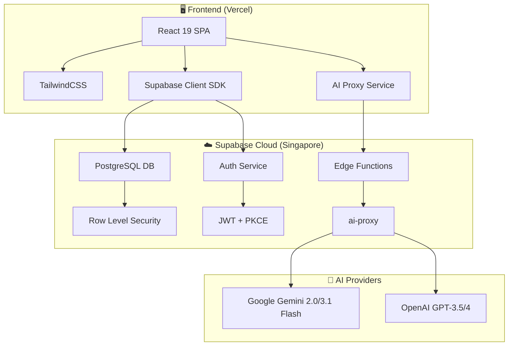
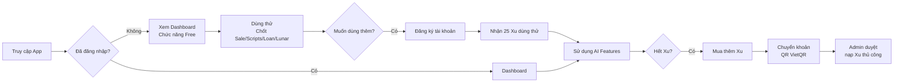
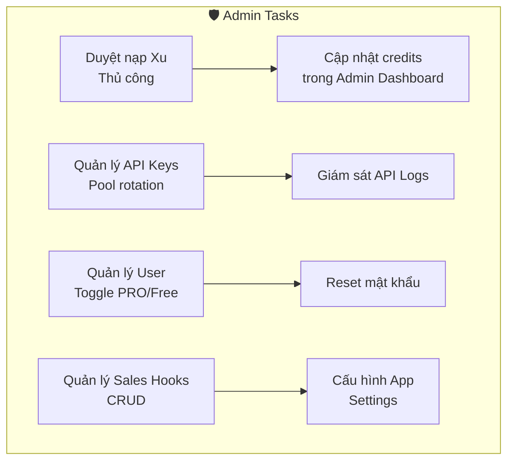
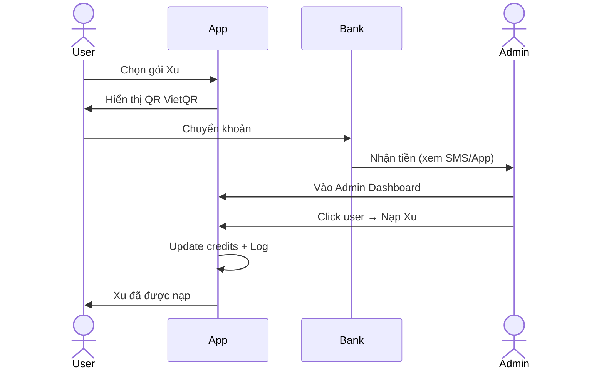

# 📋 ĐẶC TẢ ỨNG DỤNG — CHOTSALE AI (BĐS MasterKit)
### Phiên bản: v1.0.2 | Ngày phát hành: 08/03/2026
### Tài liệu rà soát toàn diện trước ngày release

---

> **Tên sản phẩm:** CHOTSALE AI (BĐS MasterKit)  
> **Slogan:** Trợ thủ đắc lực cho Môi giới Bất động sản chuyên nghiệp  
> **Tech Stack:** React 19 + Vite 7 + TailwindCSS 3 + Supabase (PostgreSQL, Auth, Edge Functions)  
> **Deploy:** Vercel (SPA) + Supabase Cloud (Singapore)  
> **Target User:** Môi giới Bất Động Sản (BĐS) cá nhân & đội nhóm tại Việt Nam  

---

## MỤC LỤC

1. [Tổng quan kiến trúc](#1-tổng-quan-kiến-trúc)
2. [Phân tích chức năng chi tiết](#2-phân-tích-chức-năng-chi-tiết)
3. [Phân tích từ góc độ Người Dùng (UX Audit)](#3-phân-tích-từ-góc-độ-người-dùng-ux-audit)
4. [Phân tích từ góc độ Nhà đầu tư](#4-phân-tích-từ-góc-độ-nhà-đầu-tư)
5. [Phân tích từ góc độ Quản lý vận hành](#5-phân-tích-từ-góc-độ-quản-lý-vận-hành)
6. [Rà soát Bảo mật](#6-rà-soát-bảo-mật)
7. [Hệ thống Credits (Xu) — Phân tích kinh doanh](#7-hệ-thống-credits-xu--phân-tích-kinh-doanh)
8. [Danh sách Phát hiện & Rủi ro Release](#8-danh-sách-phát-hiện--rủi-ro-release)
9. [Kế hoạch Cải thiện (Roadmap)](#9-kế-hoạch-cải-thiện-roadmap)
10. [Checklist Release Ngày 08/03/2026](#10-checklist-release-ngày-08032026)

---

## 1. Tổng quan Kiến trúc

### 1.1 Sơ đồ hệ thống

### 1.2 Cấu trúc Thư mục Mã nguồn

| Thư mục | Mô tả | Số file |
|---------|-------|---------|
| `src/pages/` | Các trang chính (16 file) + Admin (7 file) | 23 |
| `src/components/` | UI Components tái sử dụng | 12 |
| `src/services/` | Business Logic & AI Integration | 5 |
| `src/contexts/` | Auth Context (Global State) | 1 |
| `src/data/` | Dữ liệu tĩnh (scripts.ts) | 1 |
| `src/layouts/` | App Shell layout | 1 |
| `src/lib/` | Supabase Client khởi tạo | 1 |
| `supabase/functions/` | Edge Function (AI Proxy) | 1 |

### 1.3 Database Schema (10 bảng)

| Bảng | Mục đích | RLS | Ghi chú |
|------|---------|-----|---------|
| `profiles` | Hồ sơ người dùng (mở rộng auth.users) | ✅ | Trigger bảo vệ role/tier/credits |
| `credit_logs` | Lịch sử giao dịch xu | ✅ | User xem của mình, Admin xem tất cả |
| `transactions` | Giao dịch mua gói | ✅ | User tạo, Admin duyệt |
| `saved_clients` | CRM khách hàng | ✅ | User CRUD riêng |
| `content_history` | Lịch sử nội dung AI | ✅ | User CRUD riêng |
| `sales_scripts` | Kho kịch bản sales | ✅ | Everyone SELECT, Admin CRUD |
| `app_settings` | Cấu hình hệ thống | ✅ | Chỉ Admin |
| `api_keys` | Pool API Keys AI | ✅ | Chỉ Admin |
| `api_logs` | Nhật ký gọi API | ✅ | Admin xem tất cả, User xem của mình |
| `sales_hooks` | Chiến thuật sales AI | ✅ | Hệ thống random pick |

---

## 2. Phân tích Chức năng Chi tiết

### 2.1 Tính năng Miễn phí (Free Tier)

#### 📊 Dashboard (Trang chủ)
- **Trạng thái:** ✅ Hoàn thiện
- Hiển thị grid công cụ với icon, mô tả ngắn
- Có hiệu ứng Particles, LiveTicker, TypewriterText
- Component `DemoVideoOverlay` cho demo walkthrough
- Link nhanh đến tất cả công cụ

#### ✍️ Chốt Sale Hộ Bạn (`/chot-sale`)
- **Trạng thái:** ✅ Hoàn thiện — Tính năng cốt lõi
- **Cấu trúc 2 lớp:**
  - **Soạn Tin Đăng Bài** (nổi bật, ở trên) → Gọi `ContentCreator` component
  - **Kĩ Năng Chốt Sale** (thư mục con) → 4 thẻ chiến thuật:
    1. Phá Băng 🧊
    2. Hẹn Đi Xem 📍
    3. Chốt Cọc 💰
    4. Xử Lý Từ Chối 🛡️
- **Cơ chế miễn phí:** 5 lượt/ngày, sau đó tính 2 Xu/lượt
- **AI Engine:** Gemini 2.0 Flash qua Edge Function Proxy
- **Data-driven:** Hooks lấy từ DB (`sales_hooks`), random pick

#### 📚 Kho Kịch Bản Sales (`/scripts`)
- **Trạng thái:** ✅ Hoàn thiện
- 30+ mẫu kịch bản chia 8 danh mục
- Tìm kiếm theo từ khóa, lọc theo nhóm
- Nút Copy nhanh, Gửi Zalo
- Dữ liệu: file tĩnh `scripts.ts` (không load từ DB)

#### 🧮 Tính Lãi Suất Vay (`/loan`)
- **Trạng thái:** ✅ Hoàn thiện (file lớn: 1222 dòng, 100KB)
- 2 phương thức: Dư nợ giảm dần & EMI
- So sánh nhiều kịch bản vay
- Xuất Excel, Chia sẻ Zalo, Xuất ảnh biểu đồ
- Charts: PieChart, BarChart, AreaChart (Recharts)

#### 🌓 Lịch Âm Dương (`/lunar`)
- **Trạng thái:** ✅ Hoàn thiện
- Chuyển đổi Dương → Âm
- Hiển thị Can Chi, Giờ Hoàng Đạo
- Giao diện lịch treo tường

#### 🔮 Phong Thủy (`/feng-shui`)
- **Trạng thái:** ✅ Hoàn thiện
- Tra Bát Trạch theo năm sinh + giới tính
- Thước Lỗ Ban
- Tư vấn AI chuyên sâu (tính phí Xu)
- Component `CompassLuopan` (La bàn phong thủy)

### 2.2 Tính năng Cao cấp (PRO / Requires Login)

#### 🎨 Image Studio (`/image-studio`) — Yêu cầu PRO
- **Trạng thái:** ✅ Hoàn thiện — 4 modules:
  1. **Digital Namecard** → Card Visit chuẩn 3.5x2 inch
  2. **Nâng Cấp Ảnh** → Gemini 3.1 Flash (img2img editing)
  3. **Kiến Tạo & Render** → Text-to-Image (Gemini 3.1 Flash)
  4. **Đóng Dấu & Layout** → Sticker, Watermark, thông số BĐS
- **Công nghệ hình ảnh:** Fabric.js (canvas editing), html2canvas (export)

#### 🏢 Mini CRM (`/crm`) — Yêu cầu PRO
- **Trạng thái:** ✅ Hoàn thiện
- CRUD leads: Tên, SĐT, Trạng thái, BĐS quan tâm, Nhắc nhở
- OCR từ ảnh screenshot (Gemini Vision) → Trích xuất tên + SĐT
- Pipeline: Mới → Đang tư vấn → Đã xem nhà → Chốt → Hủy
- Tìm kiếm, Lọc theo trạng thái

### 2.3 Hệ thống Quản trị (Admin)

#### 🛡️ Admin Dashboard (`/admin`)
- **Trạng thái:** ✅ Hoàn thiện — 3 tab chính:
  1. **Khách hàng & Cấu hình:**
     - Bảng user (tên, email, SĐT, gói, credits, ngày tạo)
     - Toggle PRO/Free, Nạp/Trừ credits
     - Reset mật khẩu, Cấu hình app (AppSettings)
  2. **Quản trị Hook:**
     - CRUD Sales Hooks cho AI (`SalesHookManager`)
  3. **Giám sát AI & API:**
     - Analytics biểu đồ (`ApiUsageAnalytics`)
     - Bảng giá Model (`ModelPricing`)
     - API Logs chi tiết (`ApiLogsTable`)
     - Quản lý Pool API Keys (`ApiKeyManager`)

### 2.4 Luồng Xác thực

| Route | Component | Mô tả |
|-------|-----------|-------|
| `/login` | `Login.tsx` | Đăng nhập email/password |
| `/signup` | `SignUp.tsx` | Đăng ký tài khoản mới |
| `/forgot-password` | `ForgotPassword.tsx` | Gửi email reset |
| `/reset-password` | `ResetPassword.tsx` | Đặt lại mật khẩu |
| `/auth/confirm` | `AuthConfirm.tsx` | Xác nhận email callback |
| `/profile` | `Profile.tsx` | Cập nhật hồ sơ cá nhân |

---

## 3. Phân tích từ Góc độ Người dùng (UX Audit)

### 3.1 Điểm Mạnh ✅

| Tiêu chí | Đánh giá | Chi tiết |
|----------|---------|---------|
| **Thiết kế** | ⭐⭐⭐⭐⭐ | Dark theme premium, Glassmorphism, gradient vàng (gold), micro-animations rất đẹp |
| **Mobile First** | ⭐⭐⭐⭐ | Bottom nav responsive, layout tự động scale |
| **Onboarding** | ⭐⭐⭐ | Có video demo (DemoVideoOverlay), nhưng thiếu tour hướng dẫn tương tác |
| **Tốc độ** | ⭐⭐⭐⭐ | SPA + Vite = load nhanh, PWA cache offline |
| **Ngôn ngữ** | ⭐⭐⭐⭐⭐ | 100% tiếng Việt, phù hợp target user |
| **Copy/Share** | ⭐⭐⭐⭐⭐ | Nút copy 1 click ở mọi nơi, gửi Zalo nhanh |
| **Font chữ** | ⭐⭐⭐⭐⭐ | Inter + Montserrat, load từ Google Fonts |

### 3.2 Điểm Cần Cải thiện ⚠️

| # | Vấn đề | Mức độ | Đề xuất |
|---|--------|--------|---------|
| U1 | **Countdown giả** trên trang Pricing (`05:24:12`) là hardcode, không đếm ngược thật | 🟡 Trung bình | Bỏ hoặc implement countdown thật với deadline cụ thể |
| U2 | **Nút "Quản lý ví"** trên Pricing không có chức năng (chỉ là button rỗng) | 🟡 Trung bình | Link đến `/profile` hoặc ẩn đi |
| U3 | **Không có Error Boundary** — nếu component crash, toàn app trắng xóa | 🔴 Cao | Thêm React Error Boundary wrapper |
| U4 | **Không có toast/feedback** khi mất kết nối mạng | 🟡 Trung bình | Thêm offline detection + toast cảnh báo |
| U5 | **Title page** vẫn là "Homespro AI" trong `index.html` nhưng branding là "CHOTSALE AI" | 🟡 Trung bình | Đồng bộ title & meta tags |
| U6 | **Thiếu meta description** & OG tags cho SEO/social sharing | 🟡 Trung bình | Thêm meta tags trong `index.html` |
| U7 | **LoanCalculator.tsx 100KB** — file quá nặng, khả năng gây lag trên điện thoại yếu | 🟡 Trung bình | Tách component, lazy load |
| U8 | **Thiếu Skeleton/Loading state** khi load danh sách (chỉ có spinner đơn) | 🟢 Thấp | Thêm skeleton placeholders |
| U9 | **Chưa có Dark/Light toggle** — chỉ có dark theme | 🟢 Thấp | Dùng dark mode mặc định, không cần toggle (phù hợp branding) |
| U10 | **Navigation mobile** che nội dung phía dưới (fixed bottom nav, pb-24 padding) | 🟢 Thấp | Đã có padding, nhưng cần test kỹ trên nhiều thiết bị |

### 3.3 Luồng người dùng chính (Happy Path)

---

## 4. Phân tích từ Góc độ Nhà đầu tư

### 4.1 Mô hình Kinh doanh

| Yếu tố | Chi tiết |
|---------|---------|
| **Mô hình** | Freemium + Credit-based (Xu) |
| **Target Market** | ~50,000+ môi giới BĐS tại Việt Nam |
| **Chi phí vận hành** | Rất thấp (Vercel free tier + Supabase free/pro) |
| **Nguồn thu** | Bán gói Xu: 99K → 1.49M VNĐ |
| **Unit Economics** | 1 Xu ≈ 1,660 - 1,980 VNĐ (tùy gói) |
| **AI Cost** | Gemini Flash ≈ 0.075$/1M token ≈ gần miễn phí |

### 4.2 Phân tích SWOT

| | Tích cực | Tiêu cực |
|---|---------|---------|
| **Nội bộ** | **Strengths:** Sản phẩm AI hoàn chỉnh, UI/UX premium, chi phí vận hành cực thấp, tính năng phong phú, niche market rõ ràng | **Weaknesses:** Thanh toán thủ công (chưa auto), chưa có nền tảng mobile native, 1-man team, chưa có hệ thống referral |
| **Bên ngoài** | **Opportunities:** Thị trường BĐS Việt Nam đang phục hồi, AI adoption tăng mạnh, ít đối thủ trực tiếp trong niche, có thể mở rộng sang ngành khác | **Threats:** Big tech có thể tạo tool tương tự, phụ thuộc Google Gemini API, thay đổi pricing API, đối thủ copy tính năng |

### 4.3 Điểm Hấp dẫn cho Nhà đầu tư

1. **Margin cao:** Chi phí AI rất thấp (Gemini Flash), bán Xu lời 95%+
2. **Recurring Revenue:** Credit-based = người dùng quay lại mua tiếp
3. **Data Moat:** Tích lũy dữ liệu sales scripts, hooks, user behavior → cải thiện AI
4. **Scalable:** Supabase + Vercel auto-scale, không cần DevOps
5. **Clear GTM:** Target trực tiếp vào sàn BĐS, đội nhóm sale

### 4.4 Rủi ro cho Nhà đầu tư

| Rủi ro | Mức độ | Giải pháp |
|--------|--------|---------|
| Phụ thuộc 1 người phát triển | 🔴 Cao | Tài liệu hóa, code review |
| Thanh toán thủ công | 🔴 Cao | Tích hợp cổng thanh toán tự động |
| Chưa có hệ thống analytics user behavior | 🟡 TB | Vercel Analytics đã có, cần thêm Mixpanel/Amplitude |
| Cạnh tranh với ChatGPT/Claude trực tiếp | 🟡 TB | Giá trị nằm ở UX chuyên biệt + kho dữ liệu ngành |

---

## 5. Phân tích từ Góc độ Quản lý Vận hành

### 5.1 Quy trình Vận hành Hiện tại

### 5.2 Đánh giá Hệ thống Quản lý

| Chức năng | Trạng thái | Đánh giá |
|-----------|-----------|---------|
| Quản lý User (xem, sửa tier, credits) | ✅ Có | Đủ dùng cho giai đoạn đầu |
| API Key Pool & Rotation | ✅ Có | Tốt — tự động chọn key còn quota |
| API Logs & Analytics | ✅ Có | Biểu đồ + bảng chi tiết |
| App Settings (payment info) | ✅ Có | Cấu hình bank, giá, nội dung CK |
| Sales Hook Management | ✅ Có | CRUD hooks cho AI |
| **Notification system** | ❌ Thiếu | Cần thêm thông báo khi user nạp tiền |
| **Auto payment verification** | ❌ Thiếu | Đang duyệt thủ công |
| **User search/filter** | ❌ Thiếu | Admin table không có search bar |
| **Bulk operations** | ❌ Thiếu | Không thể thao tác hàng loạt |
| **Dashboard KPI realtime** | ⚠️ Cơ bản | Chỉ có tổng user + pro user |

### 5.3 Nhu cầu Vận hành Ưu tiên

1. **🔴 P0 — Tự động hóa nạp Xu:** Tích hợp webhook ngân hàng (Casso/SePay) để auto-verify chuyển khoản
2. **🟡 P1 — Notification Bell:** Thông báo in-app khi có giao dịch mới, Xu sắp hết
3. **🟡 P1 — Admin Search:** Thêm search bar cho bảng user
4. **🟢 P2 — Export Data:** Xuất danh sách user/logs ra CSV/Excel

---

## 6. Rà soát Bảo mật

### 6.1 Đánh giá Tổng thể: **B+ (Tốt, có thể cải thiện)**

### 6.2 Các Biện pháp Đã Triển khai ✅

| Lớp bảo mật | Chi tiết | Đánh giá |
|-------------|---------|---------|
| **RLS (Row Level Security)** | Tất cả 10 bảng đều bật RLS | ✅ Tốt |
| **Database Triggers** | Bảo vệ cột role/tier/credits — user không thể tự nâng cấp | ✅ Rất tốt |
| **AI Proxy (Edge Function)** | API keys KHÔNG bao giờ xuất hiện ở client | ✅ Rất tốt |
| **Auth PKCE Flow** | Dùng PKCE thay vì implicit flow | ✅ Tốt |
| **Credit Deduction RPC** | Hàm SECURITY DEFINER trên server — chống race condition | ✅ Rất tốt |
| **Security Headers (Vercel)** | X-Frame-Options, CSP, X-XSS-Protection, Referrer-Policy | ✅ Tốt |
| **Static Asset Caching** | Immutable cache cho /assets/ | ✅ Tốt |
| **No-cache cho index.html** | Luôn load phiên bản mới nhất | ✅ Tốt |

### 6.3 Phát hiện Bảo mật Cần Xử lý ⚠️

| # | Phát hiện | Mức độ | Chi tiết | Đề xuất |
|---|----------|--------|---------|---------|
| S1 | **Profiles SELECT policy quá rộng** | 🔴 Cao | Policy `"Public profiles are viewable by everyone"` cho phép **tất cả** (kể cả anon) SELECT toàn bộ profiles — lộ email, SĐT, tên | Sửa thành `USING (auth.uid() = id)` cho user thường, hoặc chỉ cho phép xem `full_name` + `avatar_url` |
| S2 | **DATABASE_URL trong .env.local** | 🟡 TB | File `.env.local` chứa connection string Postgres (user/pass). File này KHÔNG được commit nhờ `.gitignore`, nhưng cần double-check | Verify `.gitignore` có `*.env*`, xóa khỏi history nếu đã commit |
| S3 | **Supabase Anon Key exposed** | 🟢 Thấp | Anon key trong `.env.local` — Đây là thiết kế bình thường của Supabase (public key), RLS bảo vệ dữ liệu | Không cần action, nhưng ghi nhận |
| S4 | **CSP cho phép unsafe-eval** | 🟡 TB | `script-src 'self' 'unsafe-inline' 'unsafe-eval'` — có thể bị XSS | Nếu có thể, loại bỏ `unsafe-eval` (cần test xem Vite có cần không) |
| S5 | **Hàm `getApiKey()` vẫn tồn tại** | 🟡 TB | `aiService.ts` còn hàm `getApiKey()` gọi RPC `get_best_api_key` — đây là code cũ trước khi có proxy | Nên xóa hàm này để tránh nhầm lẫn (không còn sử dụng) |
| S6 | **Login không rate-limit** | 🟡 TB | Không có cơ chế chống brute-force ở client | Supabase Auth đã có rate limiting built-in, nhưng nên thêm captcha sau 5 lần fail |
| S7 | **Admin actions dùng `window.prompt()`** | 🟢 Thấp | `updateCredits()` dùng `window.prompt()` — UX kém và có thể bị phishing | Thay bằng modal form chuyên nghiệp |

### 6.4 Checklist Bảo mật Release

- [x] RLS enabled cho tất cả bảng
- [x] API Keys không xuất hiện trong client code
- [x] Trigger bảo vệ role/tier/credits
- [x] PKCE auth flow
- [x] Security headers trên Vercel
- [ ] ⚠️ Fix Profiles SELECT policy (S1)
- [x] Edge Function proxy cho AI calls
- [ ] ⚠️ Xóa legacy `getApiKey()` function (S5)

---

## 7. Hệ thống Credits (Xu) — Phân tích Kinh doanh

### 7.1 Bảng Giá Xu

| Gói | Xu nhận | Giá (VNĐ) | Đơn giá/Xu | Bonus |
|-----|---------|-----------|-----------|-------|
| Dùng Thử | 25 | 0 (Miễn phí) | 0 | - |
| Khởi Đầu | 50 | 99,000 | 1,980₫ | 0% |
| Tăng Trưởng ⭐ | 360 (300 + 20%) | 499,000 | 1,386₫ | +20% |
| Agency/Đội Nhóm | 1,500 (1000 + 50%) | 1,490,000 | 993₫ | +50% |

### 7.2 Định mức Tiêu dùng

| Tính năng | Chi phí (Xu) | Miễn phí/ngày |
|-----------|-------------|--------------|
| Chốt Sale AI (Chiến thuật) | 2 Xu/lượt | 5 lượt/ngày |
| Tạo nội dung AI đa kênh | 2 Xu/lượt | - |
| Thầy Phong Thủy AI | 5 Xu/lượt | - |
| AI Image Studio Premium | 1 Xu/lượt | - |
| Gỡ bỏ Watermark | 1 Xu/lượt | - |
| Image Studio cơ bản | Miễn phí | ∞ |
| Tra hướng nhà Bát Trạch | Miễn phí | ∞ |

### 7.3 Luồng Nạp Xu

### 7.4 Phân tích Doanh thu Dự kiến

| Scenario | Users | Conversion | ARPU/tháng | MRR |
|----------|-------|-----------|-----------|-----|
| Thận trọng | 500 | 5% (25 paid) | 200K | 5M/tháng |
| Trung bình | 2,000 | 8% (160 paid) | 300K | 48M/tháng |
| Lạc quan | 10,000 | 10% (1,000 paid) | 400K | 400M/tháng |

### 7.5 Vấn đề với Hệ thống Credits Hiện tại

| # | Vấn đề | Mức độ | Đề xuất |
|---|--------|--------|---------|
| C1 | **Nạp Xu hoàn toàn thủ công** — Admin phải tự verify chuyển khoản rồi nạp | 🔴 Cao | Tích hợp Casso/SePay webhook auto-verify |
| C2 | **Không có hóa đơn/email xác nhận** khi nạp Xu | 🟡 TB | Gửi email tự động qua Supabase trigger |
| C3 | **Gói "Dùng Thử" 25 Xu** chỉ hiển thị cho guest, khi đã login lại disable nút | 🟡 TB | Cần trigger tự động cấp 25 Xu khi đăng ký mới (hiện handle_new_user() KHÔNG cấp Xu) |
| C4 | **Không có cơ chế referral** — bỏ lỡ kênh viral | 🟡 TB | Thêm mã giới thiệu + thưởng Xu |
| C5 | **Chưa có subscription model** — chỉ mua Xu lẻ | 🟢 Thấp | Giai đoạn sau có thể thêm gói tháng |

> [!IMPORTANT]
> **Vấn đề C3 cần fix trước release:** Hàm `handle_new_user()` trong schema chỉ set `credits: 0`. Gói "Dùng Thử 25 Xu" chưa được implement tự động. User mới sẽ có 0 Xu, gây ấn tượng xấu.

---

## 8. Danh sách Phát hiện & Rủi ro Release

### 8.1 Phát hiện Nghiêm trọng (Blockers — Phải fix trước release) 🔴

| # | Phát hiện | File liên quan | Giải pháp |
|---|----------|---------------|---------|
| B1 | **Profiles RLS quá rộng** — bất kỳ ai đều xem được email/SĐT toàn bộ user | `supabase_schema.sql` L23-25 | Sửa SELECT policy chỉ cho user xem của mình + Admin xem tất cả |
| B2 | **Title/Branding không đồng nhất** — `index.html` ghi "Homespro AI", Navigation ghi "CHOTSALE AI", PWA manifest ghi "BĐS MasterKit" | `index.html`, `vite.config.ts`, `Navigation.tsx` | Đồng bộ tên thương hiệu |
| B3 | **Trial 25 Xu chưa auto-cấp** — User đăng ký mới sẽ có 0 Xu | `supabase_schema.sql` L158 | Sửa `handle_new_user()` set `credits: 25` |

### 8.2 Phát hiện Quan trọng (Nên fix trước release) 🟡

| # | Phát hiện | File | Giải pháp |
|---|----------|------|---------|
| I1 | Countdown giả trên Pricing | `Pricing.tsx` L122 | Bỏ hoặc làm countdown thật |
| I2 | Nút "Quản lý ví" rỗng | `Pricing.tsx` L144-146 | Link tới `/profile` |
| I3 | Legacy function `getApiKey()` | `aiService.ts` L79-114 | Xóa bỏ (đã dùng proxy) |
| I4 | File LoanCalculator quá lớn | `LoanCalculator.tsx` (100KB) | Tách sub-components |
| I5 | Thiếu Error Boundary | - | Thêm global error boundary |
| I6 | `lang="en"` trong `index.html` | `index.html` L2 | Đổi thành `lang="vi"` |

### 8.3 Phát hiện Nhẹ (Cải thiện sau release) 🟢

| # | Phát hiện | Đề xuất |
|---|----------|---------|
| L1 | Thiếu meta tags SEO (description, OG) | Thêm trong `index.html` |
| L2 | Nhiều SQL/CJS scripts ở root folder | Dọn vào thư mục `scripts/` |
| L3 | Admin table thiếu search/pagination | Thêm tính năng search |
| L4 | Thiếu skeleton loading | UX polish |
| L5 | Package version `0.0.0` | Đặt version `1.0.2` cho đúng |

---

## 9. Kế hoạch Cải thiện (Roadmap)

### Phase 1: Post-Launch Quick Wins (Tuần 1-2)
| Task | Priority | Effort |
|------|----------|--------|
| Fix B1: Profiles RLS policy | P0 | 30 phút |
| Fix B2: Đồng bộ branding | P0 | 15 phút |
| Fix B3: Auto-cấp 25 Xu trial | P0 | 30 phút |
| Fix I5: Error boundary | P1 | 1 giờ |
| Fix I6: `lang="vi"` | P1 | 5 phút |
| Fix I1: Bỏ countdown giả | P1 | 10 phút |
| Thêm meta tags SEO | P2 | 30 phút |

### Phase 2: Revenue Optimization (Tuần 3-4)
| Task | Priority | Effort |
|------|----------|--------|
| Tích hợp auto-payment (Casso/SePay webhook) | P0 | 3-5 ngày |
| Email notification khi nạp Xu thành công | P1 | 1 ngày |
| Referral system (mã giới thiệu + thưởng Xu) | P1 | 2-3 ngày |
| In-app notification bell | P2 | 1-2 ngày |

### Phase 3: Growth & Scale (Tháng 2-3)
| Task | Priority | Effort |
|------|----------|--------|
| Build Android app (CapacitorJS) | P0 | 2-3 tuần |
| Tích hợp Mixpanel/Amplitude analytics | P1 | 2 ngày |
| Multi-language support (EN) | P2 | 1 tuần |
| Admin advanced search + pagination | P2 | 2 ngày |
| Subscription model (gói tháng/năm) | P2 | 1 tuần |

### Phase 4: Enterprise (Tháng 3-6)
| Task | Priority | Effort |
|------|----------|--------|
| Team/Agency management features | P1 | 2-3 tuần |
| White-label cho sàn BĐS lớn | P2 | 1 tháng |
| API cho third-party integration | P2 | 2 tuần |
| AI Fine-tuning trên data nội bộ | P2 | Ongoing |

---

## 10. Checklist Release Ngày 08/03/2026

### ✅ Đã Sẵn sàng

- [x] Tất cả tính năng core hoạt động đúng
- [x] RLS bật ở tất cả bảng
- [x] AI Proxy qua Edge Function (key an toàn)
- [x] Credit deduction server-side (RPC)
- [x] PWA manifest + Service Worker
- [x] Security headers trên Vercel
- [x] Auth flow hoàn chỉnh (login/signup/forgot/reset)
- [x] Admin dashboard đầy đủ chức năng
- [x] UI/UX responsive (mobile + desktop)

### 🟡 Khuyến nghị Fix Trước Release (Critical)

- [ ] **B1:** Fix Profiles SELECT policy (lộ data user)
- [ ] **B2:** Đồng bộ branding (Homespro AI → CHOTSALE AI)
- [ ] **B3:** Auto-cấp 25 Xu cho user mới
- [ ] **I6:** Đổi `lang="en"` → `lang="vi"`
- [ ] **L5:** Update package version → `1.0.2`

### 🟢 Chấp nhận được — Fix sau

- [ ] Countdown giả trên Pricing
- [ ] Error Boundary
- [ ] Meta SEO tags
- [ ] Dọn dẹp root folder (SQL/CJS scripts)

---

## Phụ lục: Thông tin Kỹ thuật

### Dependencies chính

| Package | Version | Mục đích |
|---------|---------|---------|
| react | ^19.2.0 | UI Framework |
| react-router-dom | ^6.22.0 | Client-side routing |
| @supabase/supabase-js | ^2.39.3 | Backend client |
| tailwindcss | ^3.4.1 | Styling |
| recharts | ^3.7.0 | Biểu đồ |
| fabric | ^5.3.0 | Canvas editing (Image Studio) |
| html2canvas | ^1.4.1 | Export ảnh |
| xlsx | ^0.18.5 | Export Excel |
| lunar-javascript | ^1.7.7 | Lịch âm dương |
| tesseract.js | ^7.0.0 | OCR (không rõ có dùng không) |
| vite-plugin-pwa | ^0.19.0 | Progressive Web App |
| lucide-react | ^0.363.0 | Icons |
| react-hot-toast | ^2.6.0 | Toast notifications |
| @vercel/analytics | ^1.6.1 | Web analytics |

### Thông tin Deploy

| Mục | Giá trị |
|-----|---------|
| Frontend Host | Vercel |
| Backend | Supabase Cloud |
| Region | Singapore (ap-south-1) |
| Database | PostgreSQL 15 |
| Auth | Supabase Auth (PKCE) |
| Edge Functions | Deno (Supabase) |
| CDN | Vercel Edge Network |
| Domain | (cần cấu hình custom domain) |

---

> 📝 **Tài liệu này được tạo bởi AI Code Auditor vào ngày 08/03/2026.**  
> Phiên bản: v1.0 | Tác giả rà soát: Antigravity AI Assistant
