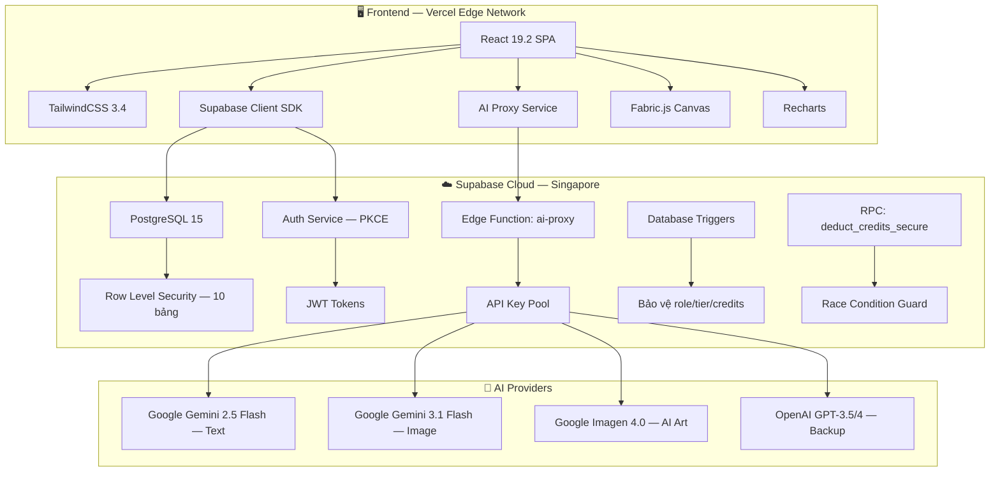
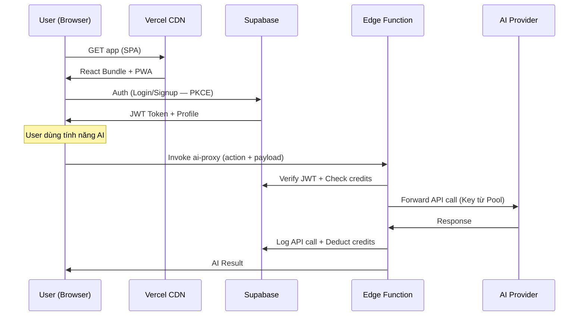
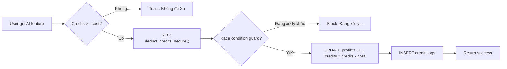
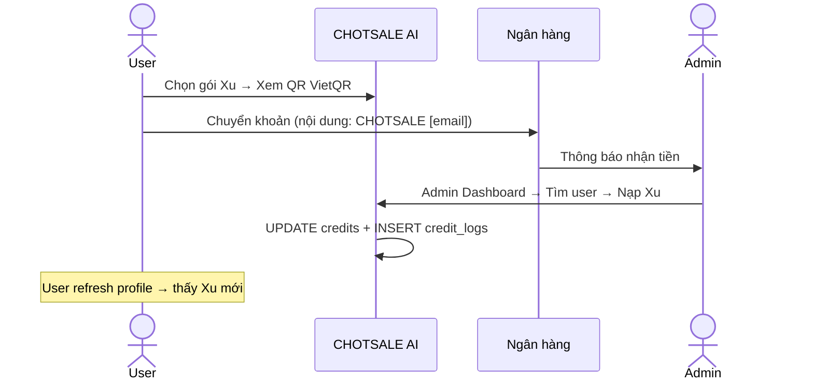
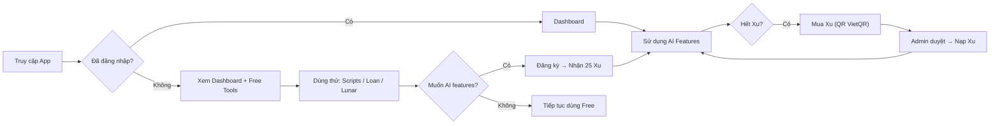
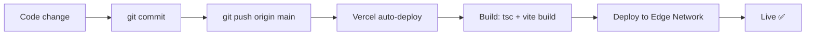

# 📋 ĐẶC TẢ HỆ THỐNG — CHOTSALE AI (BĐS MasterKit)
### Phiên bản: v2.0 | Cập nhật: 11/03/2026
### Tài liệu đặc tả kỹ thuật & vận hành toàn diện

---

> **Tên sản phẩm:** CHOTSALE AI  
> **Package name:** `chotsale-ai`  
> **Phiên bản mã nguồn:** `1.0.2`  
> **Slogan:** Trợ thủ đắc lực cho Môi giới Bất động sản chuyên nghiệp  
> **Tech Stack:** React 19.2 + Vite 7.3 + TailwindCSS 3.4 + Supabase (PostgreSQL 15, Auth PKCE, Edge Functions)  
> **Deploy:** Vercel (SPA, Edge Network) + Supabase Cloud (Singapore, ap-south-1)  
> **Target User:** Môi giới Bất Động Sản (BĐS) cá nhân & đội nhóm tại Việt Nam  
> **Ngôn ngữ giao diện:** 100% Tiếng Việt  

---

## MỤC LỤC

1. [Tổng quan Kiến trúc](#1-tổng-quan-kiến-trúc)
2. [Cây thư mục Mã nguồn](#2-cây-thư-mục-mã-nguồn)
3. [Database Schema](#3-database-schema)
4. [Routing & Phân quyền](#4-routing--phân-quyền)
5. [Đặc tả Chức năng Chi tiết](#5-đặc-tả-chức-năng-chi-tiết)
6. [Hệ thống Xác thực (Auth)](#6-hệ-thống-xác-thực-auth)
7. [Hệ thống Credits (Xu)](#7-hệ-thống-credits-xu)
8. [Tích hợp AI](#8-tích-hợp-ai)
9. [Bảo mật](#9-bảo-mật)
10. [Phân tích UX](#10-phân-tích-ux)
11. [Phân tích Kinh doanh](#11-phân-tích-kinh-doanh)
12. [Hạ tầng & Triển khai](#12-hạ-tầng--triển-khai)
13. [Roadmap](#13-roadmap)
14. [Phụ lục Kỹ thuật](#14-phụ-lục-kỹ-thuật)

---

## 1. Tổng quan Kiến trúc

### 1.1 Sơ đồ hệ thống



### 1.2 Luồng dữ liệu chính



---

## 2. Cây thư mục Mã nguồn

```
src/
├── App.tsx                    # Router chính (69 dòng)
├── main.tsx                   # Entry point + PWA registration
├── index.css                  # Global styles + TailwindCSS
├── App.css                    # App-level styles
│
├── pages/                     # 16 trang chính
│   ├── Dashboard.tsx          # Trang chủ (19.7KB)
│   ├── SalesStrategy.tsx      # Chốt Sale AI (33KB)
│   ├── ContentCreator.tsx     # Soạn Tin AI (24KB)
│   ├── ImageStudio.tsx        # Studio Sáng Tạo Hub (6KB)
│   ├── LoanCalculator.tsx     # Tính Lãi Vay (103KB ⚠️)
│   ├── SalesScripts.tsx       # Kho Kịch Bản (11KB)
│   ├── FengShui.tsx           # Phong Thủy (26KB)
│   ├── LunarCalendar.tsx      # Lịch Âm Dương (16KB)
│   ├── MiniCRM.tsx            # CRM Khách Hàng (30KB)
│   ├── Pricing.tsx            # Bảng Giá Xu (27KB)
│   ├── Profile.tsx            # Hồ Sơ Cá Nhân (31KB)
│   ├── Login.tsx              # Đăng Nhập (12KB)
│   ├── SignUp.tsx              # Đăng Ký (15KB)
│   ├── ForgotPassword.tsx     # Quên Mật Khẩu (8KB)
│   ├── ResetPassword.tsx      # Đặt Lại MK (10KB)
│   └── AuthConfirm.tsx        # Xác Nhận Email (7KB)
│
├── pages/admin/               # 7 trang quản trị
│   ├── Dashboard.tsx          # Admin Overview (23KB)
│   ├── AppSettings.tsx        # Cấu Hình App (28KB)
│   ├── ApiUsageAnalytics.tsx  # Analytics (23KB)
│   ├── SalesHookManager.tsx   # Quản Lý Hook (27KB)
│   ├── ApiLogsTable.tsx       # Log API (19KB)
│   ├── ModelPricing.tsx       # Giá Model AI (12KB)
│   └── ApiKeyManager.tsx      # Pool API Keys (11KB)
│
├── components/                # UI Components
│   ├── Navigation.tsx         # Side/Bottom Nav (11KB)
│   ├── ProtectedRoute.tsx     # Route Guard (3KB)
│   ├── DemoVideoOverlay.tsx   # Video Demo Modal (7KB)
│   ├── LiveTicker.tsx         # Tin tức trượt (3KB)
│   ├── TypewriterText.tsx     # Animation typing (1KB)
│   ├── Particles.tsx          # Hiệu ứng hạt (3KB)
│   ├── ChotsaleLogo.tsx       # Logo SVG (1KB)
│   ├── ImageStudio/
│   │   ├── AiStudio.tsx       # AI Image Editing (43KB)
│   │   ├── CardCreator.tsx    # Name Card/Tag (56KB)
│   │   └── QuickEditor.tsx    # Đóng Dấu & Layout (94KB)
│   └── FengShui/
│       └── CompassLuopan.tsx  # La Bàn Phong Thủy
│
├── services/                  # Business Logic
│   ├── aiProxy.ts             # Edge Function client (2.5KB)
│   ├── aiService.ts           # AI orchestration (33KB)
│   ├── contentGenerator.ts    # Content AI helpers (3KB)
│   ├── fengShui.ts            # Phong thủy logic (10KB)
│   └── settingsService.ts    # App settings cache (1KB)
│
├── contexts/
│   └── AuthContext.tsx        # Auth + Profile state (7KB)
│
├── data/
│   └── scripts.ts             # Kho kịch bản sales (tĩnh)
│
├── layouts/
│   └── AppShell.tsx           # Main layout wrapper
│
├── lib/
│   └── supabaseClient.ts     # Supabase init
│
└── utils/
    ├── idGenerator.ts         # UUID generator
    └── imageUtils.ts          # Image optimization
```

### Thống kê Mã nguồn

| Metric | Giá trị |
|--------|---------|
| **Tổng file TS/TSX** | ~40 file |
| **Tổng dung lượng src** | ~850KB |
| **File lớn nhất** | `LoanCalculator.tsx` (103KB) ⚠️ |
| **Component phức tạp nhất** | `QuickEditor.tsx` (94KB, 1577 dòng) |

---

## 3. Database Schema

### 3.1 Danh sách Bảng (10 bảng)

| # | Bảng | Mục đích | RLS | Rows ước tính |
|---|------|---------|-----|---------------|
| 1 | `profiles` | Hồ sơ user (mở rộng `auth.users`) | ✅ | = số user |
| 2 | `credit_logs` | Lịch sử giao dịch Xu | ✅ | Cao |
| 3 | `transactions` | Giao dịch mua gói Xu | ✅ | Trung bình |
| 4 | `saved_clients` | CRM khách hàng (per-user) | ✅ | Trung bình |
| 5 | `content_history` | Lịch sử nội dung AI | ✅ | Cao |
| 6 | `sales_scripts` | Kho kịch bản (admin-managed) | ✅ | Thấp (~30) |
| 7 | `app_settings` | Cấu hình hệ thống (key-value) | ✅ | Thấp (~20) |
| 8 | `api_keys` | Pool API Keys cho AI | ✅ | Thấp (~5) |
| 9 | `api_logs` | Nhật ký gọi API AI | ✅ | Rất cao |
| 10 | `sales_hooks` | Chiến thuật sales cho AI | ✅ | Thấp (~20) |

### 3.2 Schema chi tiết: `profiles`

| Cột | Kiểu | Mô tả |
|-----|------|-------|
| `id` | UUID (PK, FK→auth.users) | ID người dùng |
| `role` | TEXT (`'user'` / `'admin'`) | Vai trò — **Trigger bảo vệ** |
| `tier` | TEXT (`'free'` / `'pro'`) | Gói dịch vụ — **Trigger bảo vệ** |
| `full_name` | TEXT | Họ tên đầy đủ |
| `phone` | TEXT | Số điện thoại |
| `agency` | TEXT | Tên công ty/sàn |
| `job_title` | TEXT | Chức danh |
| `company_address` | TEXT | Địa chỉ công ty |
| `website` | TEXT | Website |
| `business_email` | TEXT | Email công việc |
| `avatar_url` | TEXT | URL ảnh đại diện |
| `company_logo` | TEXT | URL logo công ty |
| `credits` | INTEGER | Số Xu hiện có — **Trigger bảo vệ** |

### 3.3 Database Functions (RPC)

| Function | Loại | Mô tả |
|----------|------|-------|
| `deduct_credits_secure(p_cost, p_action)` | SECURITY DEFINER | Trừ Xu an toàn, chống race condition |
| `handle_new_user()` | TRIGGER | Tạo profile khi user đăng ký, cấp 25 Xu |
| `protect_sensitive_columns()` | TRIGGER | Chặn user tự sửa role/tier/credits |

---

## 4. Routing & Phân quyền

### 4.1 Bảng Routing

| Route | Component | Quyền truy cập | Mô tả |
|-------|-----------|----------------|-------|
| `/` | `Dashboard` | 🌐 Public | Trang chủ — Hub điều hướng |
| `/loan` | `LoanCalculator` | 🌐 Public | Tính lãi suất vay |
| `/feng-shui` | `FengShui` | 🌐 Public | Phong thủy BĐS |
| `/lunar` | `LunarCalendar` | 🌐 Public | Lịch âm dương |
| `/scripts` | `SalesScripts` | 🌐 Public | Kho kịch bản sales |
| `/pricing` | `Pricing` | 🌐 Public | Bảng giá Xu |
| `/login` | `Login` | 🌐 Public | Đăng nhập |
| `/signup` | `SignUp` | 🌐 Public | Đăng ký |
| `/forgot-password` | `ForgotPassword` | 🌐 Public | Quên mật khẩu |
| `/reset-password` | `ResetPassword` | 🌐 Public | Reset mật khẩu |
| `/auth/confirm` | `AuthConfirm` | 🌐 Public | Callback xác nhận email |
| `/profile` | `Profile` | 🔒 Login | Hồ sơ cá nhân |
| `/chot-sale` | `SalesStrategy` | 💎 PRO | Chốt Sale AI |
| `/content` | → Redirect `/chot-sale` | — | Redirect cũ |
| `/image-studio` | `ImageStudio` | 💎 PRO | Studio Sáng Tạo |
| `/crm` | `MiniCRM` | 💎 PRO | CRM khách hàng |
| `/admin` | `AdminDashboard` | 🛡️ Admin | Bảng điều khiển quản trị |

### 4.2 Cơ chế Phân quyền

- **ProtectedRoute** (`src/components/ProtectedRoute.tsx`):
  - `requirePro`: Kiểm tra `profile.tier === 'pro'` hoặc `profile.role === 'admin'`
  - `requireAdmin`: Kiểm tra `profile.role === 'admin'`
  - Nếu chưa login → redirect `/login`
  - Nếu không đủ quyền → hiển thị thông báo + link `/pricing`

---

## 5. Đặc tả Chức năng Chi tiết

### 5.1 Dashboard (`/`)

| Thuộc tính | Giá trị |
|------------|---------|
| **File** | `src/pages/Dashboard.tsx` (19.7KB) |
| **Trạng thái** | ✅ Hoàn thiện |
| **Layout** | Responsive: Mobile (single column) + Desktop (grid 3 cols) |

**Thành phần:**
- **Hero Banner** → Link tới `/image-studio` (studio sáng tạo đầy đủ)
- **Grid Tools** → 5 công cụ với icon, mô tả, badge (VIP/Free), nút Demo
- **Hiệu ứng:** Particles background, LiveTicker tin tức, TypewriterText greeting
- **DemoVideoOverlay:** Modal video walkthrough cho từng công cụ

**Danh sách Tools trên Dashboard:**

| # | Tool | Route | Badge | Icon |
|---|------|-------|-------|------|
| 1 | Chốt Sale | `/chot-sale` | VIP | Target |
| 2 | Tính Lãi | `/loan` | Free | Calculator |
| 3 | Kịch Bản | `/scripts` | Free | MessageSquare |
| 4 | CRM Mini | `/crm` | VIP | Users |
| 5 | Lịch & Phong Thủy | `/lunar` | Free | Calendar |

---

### 5.2 Chốt Sale Hộ Bạn (`/chot-sale`)

| Thuộc tính | Giá trị |
|------------|---------|
| **File** | `src/pages/SalesStrategy.tsx` (33KB, 517 dòng) |
| **Trạng thái** | ✅ Hoàn thiện — Tính năng cốt lõi |
| **Quyền** | 💎 PRO |
| **AI Model** | Gemini 2.5 Flash (qua Edge Function) |
| **Chi phí** | 5 lượt miễn phí/ngày, sau đó 2 Xu/lượt |

**Cấu trúc 2 lớp:**

1. **Soạn Tin Đăng Bài** (nổi bật, ở trên)
   - Component: `ContentCreator` (embedded)
   - Tạo bài đăng BĐS đa kênh (Zalo, Facebook, ...)
   
2. **Kĩ Năng Chốt Sale** (thư mục con) → 4 chiến thuật:

   | # | Thẻ | Emoji | Mô tả |
   |---|-----|-------|-------|
   | 1 | Phá Băng | 🧊 | Mở đầu cuộc trò chuyện |
   | 2 | Hẹn Đi Xem | 📍 | Mời khách xem nhà |
   | 3 | Chốt Cọc | 💰 | Thúc đẩy quyết định |
   | 4 | Xử Lý Từ Chối | 🛡️ | Xoay chuyển phản đối |

**Cơ chế hoạt động:**
- User chọn thẻ → chọn tags tình huống → AI sinh chiến thuật
- AI nhận `sales_hooks` ngẫu nhiên từ DB → output gồm `strategy` + `sample_message`
- Nút Copy nhanh, chia sẻ Zalo

---

### 5.3 Image Studio (`/image-studio`)

| Thuộc tính | Giá trị |
|------------|---------|
| **File** | `src/pages/ImageStudio.tsx` (6KB) — Hub điều hướng |
| **Sub-components** | `CardCreator.tsx` (56KB), `AiStudio.tsx` (43KB), `QuickEditor.tsx` (94KB) |
| **Trạng thái** | ✅ Hoàn thiện — 4 modules |
| **Quyền** | 💎 PRO |
| **Công nghệ** | Fabric.js 5.3, html2canvas, QRCode |

**4 Modules:**

| # | Module | Component | Mô tả | AI? |
|---|--------|-----------|-------|-----|
| 1 | **Digital Namecard** | `CardCreator` | Card Visit 3.5x2" + Name Tag | ❌ |
| 2 | **Nâng Cấp Ảnh** | `AiStudio (enhance)` | Dọn dẹp, thêm nội thất, flycam | ✅ Gemini 3.1 Flash |
| 3 | **Kiến Tạo & Render** | `AiStudio (creator)` | Text-to-Image, render phối cảnh | ✅ Imagen 4.0 |
| 4 | **Đóng Dấu & Layout** | `QuickEditor` | Sticker, watermark, thông số BĐS | ❌ |

**Digital Namecard — Chi tiết:**
- 3 template: Orange Waves, Luxury Gold, Blue Geo
- 2 chế độ: Card Visit (1050×600) + Name Tag (450×130)
- Card Visit: Mặt trước (logo/brand) + Mặt sau (thông tin + QR Code Zalo)
- Tự động sync dữ liệu từ Profile (tên, SĐT, email, công ty, avatar)
- Upload logo công ty tùy chỉnh
- QR Code tự động generate link Zalo
- Export PNG chất lượng cao
- **Gắn Tag vào Ảnh:** Export nametag → chuyển sang QuickEditor overlay lên ảnh BĐS

**AI Image Studio — Chi tiết:**
- **Enhance mode:** Upload ảnh → chọn kiểu (nội thất, ngoại thất, tổng quan) → AI nâng cấp
- **Creator mode:** Nhập mô tả → chọn kiểu bất động sản + phong cách → AI sinh ảnh
- Chọn kích thước: 1:1, 16:9, 3:4, 4:3
- Chế độ Flycam (góc rộng từ trên cao)
- Chi phí: 10 Xu/ảnh sửa, 10 Xu/ảnh tạo mới, +10 Xu nếu bật Flycam

---

### 5.4 Kho Kịch Bản Sales (`/scripts`)

| Thuộc tính | Giá trị |
|------------|---------|
| **File** | `src/pages/SalesScripts.tsx` (11KB) |
| **Trạng thái** | ✅ Hoàn thiện |
| **Quyền** | 🌐 Free |
| **Dữ liệu** | File tĩnh `src/data/scripts.ts` |

- 30+ mẫu kịch bản, 8 danh mục
- Tìm kiếm theo từ khóa, lọc theo nhóm
- Nút Copy nhanh, Gửi Zalo

---

### 5.5 Tính Lãi Suất Vay (`/loan`)

| Thuộc tính | Giá trị |
|------------|---------|
| **File** | `src/pages/LoanCalculator.tsx` (103KB ⚠️ cần tách) |
| **Trạng thái** | ✅ Hoàn thiện |
| **Quyền** | 🌐 Free |

- 2 phương thức: Dư nợ giảm dần & EMI
- So sánh nhiều kịch bản vay
- Charts: PieChart, BarChart, AreaChart (Recharts)
- Xuất Excel (xlsx), Chia sẻ Zalo, Xuất ảnh biểu đồ

---

### 5.6 Lịch Âm Dương & Phong Thủy (`/lunar`, `/feng-shui`)

| Thuộc tính | Lịch Âm | Phong Thủy |
|------------|---------|------------|
| **File** | `LunarCalendar.tsx` (16KB) | `FengShui.tsx` (26KB) |
| **Trạng thái** | ✅ Hoàn thiện | ✅ Hoàn thiện |
| **Quyền** | 🌐 Free | 🌐 Free (tra cứu), 💰 Xu (AI tư vấn) |

**Lịch Âm:**
- Chuyển đổi Dương → Âm (thư viện `lunar-javascript`)
- Hiển thị Can Chi, Giờ Hoàng Đạo
- Giao diện lịch treo tường responsive

**Phong Thủy:**
- Tra Bát Trạch theo năm sinh + giới tính
- Thước Lỗ Ban (kiểm tra kích thước)
- Component `CompassLuopan` (La bàn phong thủy SVG)
- Tư vấn AI chuyên sâu (tính phí 5 Xu/lượt)

---

### 5.7 Mini CRM (`/crm`)

| Thuộc tính | Giá trị |
|------------|---------|
| **File** | `src/pages/MiniCRM.tsx` (30KB) |
| **Trạng thái** | ✅ Hoàn thiện |
| **Quyền** | 💎 PRO |
| **Lưu trữ** | Supabase (`saved_clients` table, RLS per-user) |

- CRUD leads: Tên, SĐT, Trạng thái, BĐS quan tâm, Ghi chú, Nhắc nhở
- OCR từ ảnh screenshot (Gemini Vision) → Trích xuất tên + SĐT
- Pipeline: `Mới` → `Đang tư vấn` → `Đã xem nhà` → `Chốt` → `Hủy`
- Tìm kiếm, Lọc theo trạng thái

---

### 5.8 Hệ thống Quản trị Admin (`/admin`)

| Thuộc tính | Giá trị |
|------------|---------|
| **File chính** | `src/pages/admin/Dashboard.tsx` (23KB) |
| **Trạng thái** | ✅ Hoàn thiện |
| **Quyền** | 🛡️ Admin only |

**Tab 1: Khách hàng & Cấu hình**
- Bảng user (tên, email, SĐT, gói, credits, ngày tạo)
- Toggle PRO/Free per user
- Nạp/Trừ credits thủ công
- Reset mật khẩu user
- `AppSettings.tsx` (28KB): Cấu hình bank, giá Xu, nội dung CK, AI model mặc định

**Tab 2: Quản trị Hook**
- `SalesHookManager.tsx` (27KB)
- CRUD Sales Hooks cho AI (tên, nội dung, trạng thái active/inactive)

**Tab 3: Giám sát AI & API**
- `ApiUsageAnalytics.tsx` (23KB): Biểu đồ API calls, success rate, DAU
- `ModelPricing.tsx` (12KB): Bảng giá các model AI
- `ApiLogsTable.tsx` (19KB): Log chi tiết từng API call
- `ApiKeyManager.tsx` (11KB): Pool API Keys (thêm/xóa/kiểm tra quota)

---

## 6. Hệ thống Xác thực (Auth)

### 6.1 Luồng Auth

| Hành động | Route | Phương thức |
|-----------|-------|-------------|
| Đăng nhập | `/login` | Email + Password (Supabase Auth) |
| Đăng ký | `/signup` | Email + Password + Full Name |
| Quên MK | `/forgot-password` | Email link reset |
| Reset MK | `/reset-password` | Token từ email link |
| Xác nhận email | `/auth/confirm` | Callback URL từ Supabase |
| Đăng xuất | — | `supabase.auth.signOut()` + redirect `/login` |

### 6.2 AuthContext State

```typescript
interface AuthContextType {
    session: Session | null;       // Supabase session
    user: User | null;             // Auth user
    profile: Profile | null;       // DB profile (role, tier, credits...)
    loading: boolean;              // Auth loading
    profileLoading: boolean;       // Profile fetch loading
    signOut: () => Promise<void>;  // Xóa state + signOut + redirect
    refreshProfile: () => Promise<void>; // Reload profile từ DB
}
```

### 6.3 Cơ chế bảo vệ

- **10s Safety Timeout:** Nếu auth hoặc profile load bị treo, tự mở khóa UI sau 10s
- **TOKEN_REFRESHED:** Không bật loading spinner khi refresh token (tránh UI nháy)
- **Profile null-guard:** Chỉ set profile nếu fetch thành công, tránh mạng lỗi đè null làm mất quyền VIP
- **Immediate signOut:** Set state null **trước** khi gọi `supabase.auth.signOut()` → UX tức thì

---

## 7. Hệ thống Credits (Xu)

### 7.1 Bảng Giá Xu

| Gói | Xu nhận | Giá (VNĐ) | Đơn giá/Xu | Bonus |
|-----|---------|-----------|-----------|-------|
| Dùng Thử | 25 | 0 (Miễn phí) | 0 | — |
| Khởi Đầu | 50 | 99,000 | 1,980₫ | 0% |
| Tăng Trưởng ⭐ | 360 (300 + 20%) | 499,000 | 1,386₫ | +20% |
| Agency/Đội Nhóm | 1,500 (1000 + 50%) | 1,490,000 | 993₫ | +50% |

### 7.2 Bảng chi phí Xu theo tính năng

| Tính năng | Chi phí | Miễn phí/ngày | Ghi chú |
|-----------|---------|---------------|---------|
| Chốt Sale AI (4 chiến thuật) | 2 Xu/lượt | 5 lượt/ngày | Đếm qua `api_logs` |
| Soạn Tin Đăng Bài | 2 Xu/lượt | — | |
| Thầy Phong Thủy AI | 5 Xu/lượt | — | |
| Sửa ảnh AI (Enhance) | 10 Xu/ảnh | — | |
| Tạo ảnh AI (Creator) | 10 Xu/ảnh | — | |
| Chế độ Flycam | +10 Xu/ảnh | — | Cộng thêm vào chi phí sửa/tạo |
| Name Card / Name Tag | Miễn phí | ∞ | Không dùng AI |
| Đóng Dấu & Layout | Miễn phí | ∞ | Không dùng AI |
| Tính Lãi Vay | Miễn phí | ∞ | |
| Kho Kịch Bản | Miễn phí | ∞ | |
| Lịch Âm Dương | Miễn phí | ∞ | |
| Tra Bát Trạch Phong Thủy | Miễn phí | ∞ | |

### 7.3 Cơ chế trừ Xu



### 7.4 Luồng Nạp Xu (Hiện tại: Thủ công)



---

## 8. Tích hợp AI

### 8.1 Kiến trúc AI Proxy

```
Client → aiProxy.ts → Supabase Edge Function (ai-proxy)
                              ↓
                    Verify JWT + Check credits
                              ↓
                    Chọn API Key từ Pool (round-robin)
                              ↓
                    Gọi AI Provider (Gemini / OpenAI)
                              ↓
                    Log kết quả vào api_logs
                              ↓
                    Return response cho client
```

### 8.2 AI Models đang sử dụng

| Provider | Model | Mục đích | Chi phí API |
|----------|-------|----------|-------------|
| Google | `gemini-2.5-flash` | Text generation (sales, content, feng shui) | ~$0.075/1M tokens |
| Google | `gemini-2.0-flash` | Legacy text gen (fallback) | ~$0.075/1M tokens |
| Google | `gemini-3.1-flash` | Image editing (img2img) | Variable |
| Google | `imagen-4.0-generate-001` | Text-to-Image generation | Variable |
| OpenAI | `gpt-3.5-turbo` | Backup text gen | ~$0.50/1M tokens |

### 8.3 AI Functions (`aiService.ts`)

| Function | Mô tả | Model |
|----------|-------|-------|
| `generateSalesStrategyAI()` | Sinh chiến thuật + tin nhắn mẫu | Gemini Flash |
| `generateContentAI()` | Soạn bài đăng BĐS | Gemini Flash |
| `generateFengShuiAdvice()` | Tư vấn phong thủy | Gemini Flash |
| `enhanceImage()` | Nâng cấp/sửa ảnh BĐS | Gemini 3.1 Flash |
| `generateImage()` | Tạo ảnh từ text | Imagen 4.0 |
| `extractContactFromImage()` | OCR trích xuất tên + SĐT | Gemini Vision |
| `checkAndDeductCredits()` | Kiểm tra & trừ Xu (RPC server-side) | — |

### 8.4 AI Proxy Functions (`aiProxy.ts`)

| Function | Mô tả |
|----------|-------|
| `geminiGenerate()` | Gọi Gemini text API qua proxy |
| `openaiChat()` | Gọi OpenAI API qua proxy |
| `geminiGenerateImage()` | Gọi Imagen API qua proxy |

---

## 9. Bảo mật

### 9.1 Đánh giá Tổng thể: **A- (Rất tốt)**

### 9.2 Các biện pháp đã triển khai ✅

| Lớp | Chi tiết | Đánh giá |
|-----|---------|----------|
| **RLS** | 10/10 bảng bật RLS | ✅ Tốt |
| **DB Triggers** | Bảo vệ `role`, `tier`, `credits` — chặn user tự nâng cấp | ✅ Rất tốt |
| **AI Proxy** | API keys **KHÔNG BAO GIỜ** xuất hiện trên client | ✅ Rất tốt |
| **Auth PKCE** | Dùng PKCE flow thay implicit | ✅ Tốt |
| **Credit RPC** | `SECURITY DEFINER` trên server, chống race condition | ✅ Rất tốt |
| **Vercel Headers** | X-Frame-Options, CSP, XSS-Protection, Referrer-Policy | ✅ Tốt |
| **Asset Caching** | Immutable cache `/assets/`, no-cache cho `index.html` | ✅ Tốt |
| **Branding** | `lang="vi"`, title/meta/OG tags đồng bộ CHOTSALE AI | ✅ Đã fix |

### 9.3 CSP (Content Security Policy)

```
default-src 'self';
script-src 'self' 'unsafe-inline' 'unsafe-eval';
style-src 'self' 'unsafe-inline' https://fonts.googleapis.com;
font-src 'self' https://fonts.gstatic.com;
img-src 'self' data: https: blob:;
connect-src 'self' https://*.supabase.co https://generativelanguage.googleapis.com https://api.openai.com https://ui-avatars.com;
media-src 'self' https:;
frame-src 'none'
```

### 9.4 Phát hiện cần lưu ý

| # | Mô tả | Mức độ | Trạng thái |
|---|-------|--------|-----------|
| S1 | Profiles SELECT policy — cần giới hạn chỉ xem của mình + Admin xem tất cả | 🟡 | Cần kiểm tra |
| S2 | `unsafe-eval` trong CSP — Vite HMR cần khi dev, production nên kiểm tra | 🟡 | Chấp nhận |
| S3 | Legacy `getApiKey()` trong `aiService.ts` — code cũ không dùng nữa | 🟢 | Nên xóa dọn |
| S4 | Admin actions dùng `window.prompt()` — UX kém | 🟢 | Cải thiện sau |

---

## 10. Phân tích UX

### 10.1 Điểm mạnh ✅

| Tiêu chí | Đánh giá | Chi tiết |
|----------|----------|---------|
| **Thiết kế** | ⭐⭐⭐⭐⭐ | Dark premium, Glassmorphism, gradient gold, micro-animations |
| **Mobile First** | ⭐⭐⭐⭐ | Bottom nav responsive, layout tự scale |
| **Tốc độ** | ⭐⭐⭐⭐ | SPA + Vite = load nhanh, PWA cache |
| **Ngôn ngữ** | ⭐⭐⭐⭐⭐ | 100% tiếng Việt, phù hợp target user |
| **Copy/Share** | ⭐⭐⭐⭐⭐ | Copy 1 click, gửi Zalo nhanh ở mọi nơi |
| **Typography** | ⭐⭐⭐⭐⭐ | Inter + Montserrat, Vietnamese subset |
| **Onboarding** | ⭐⭐⭐ | Có video demo, thiếu interactive tour |

### 10.2 Luồng người dùng chính



### 10.3 Cải thiện cần thực hiện

| # | Vấn đề | Mức độ |
|---|--------|--------|
| U1 | `LoanCalculator.tsx` 103KB — cần tách component, lazy load | 🟡 |
| U2 | Thiếu Error Boundary toàn cục | 🟡 |
| U3 | Thiếu offline detection + toast | 🟢 |
| U4 | Countdown trên Pricing đã hết hạn (target: 10/03/2026) | 🟡 |
| U5 | Thiếu skeleton loading states | 🟢 |

---

## 11. Phân tích Kinh doanh

### 11.1 Mô hình

| Yếu tố | Chi tiết |
|---------|---------|
| **Mô hình** | Freemium + Credit-based (Xu) |
| **Thị trường** | ~50,000+ môi giới BĐS Việt Nam |
| **Chi phí vận hành** | Rất thấp (Vercel free + Supabase free/pro) |
| **Nguồn thu** | Bán gói Xu: 99K → 1.49M VNĐ |
| **AI Cost** | Gemini Flash ≈ $0.075/1M tokens ≈ gần miễn phí |
| **Margin** | >95% (bán Xu vs chi phí AI) |

### 11.2 SWOT

| | Tích cực | Tiêu cực |
|---|---------|---------|
| **Nội bộ** | Sản phẩm AI hoàn chỉnh, UI premium, chi phí cực thấp, niche rõ ràng | Thanh toán thủ công, 1-man team, chưa có mobile native |
| **Bên ngoài** | Thị trường BĐS phục hồi, AI adoption tăng mạnh, ít đối thủ trực tiếp | Big tech tạo tool tương tự, phụ thuộc Gemini API |

### 11.3 Doanh thu Dự kiến

| Scenario | Users | Conversion | ARPU/tháng | MRR |
|----------|-------|-----------|-----------|-----|
| Thận trọng | 500 | 5% (25 paid) | 200K | 5M/tháng |
| Trung bình | 2,000 | 8% (160 paid) | 300K | 48M/tháng |
| Lạc quan | 10,000 | 10% (1,000 paid) | 400K | 400M/tháng |

---

## 12. Hạ tầng & Triển khai

### 12.1 Deployment Architecture

| Thành phần | Service | Region |
|------------|---------|--------|
| Frontend (SPA) | Vercel | Edge Network (Global) |
| Database | Supabase PostgreSQL 15 | Singapore (ap-south-1) |
| Auth | Supabase Auth (PKCE) | Singapore |
| Edge Functions | Supabase (Deno Runtime) | Singapore |
| CDN | Vercel Edge Network | Auto |
| DNS | Vercel | — |
| Analytics | Vercel Analytics | — |

### 12.2 Vercel Configuration (`vercel.json`)

- **SPA Rewrite:** Tất cả routes → `/index.html`
- **Security Headers:** CSP, X-Frame-Options, XSS-Protection, Referrer-Policy, Permissions-Policy
- **Caching:** Assets immutable 1 year, `index.html` + `sw.js` no-cache

### 12.3 Quy trình Deploy



### 12.4 Environment Variables

| Biến | Nơi lưu | Mô tả |
|------|---------|-------|
| `VITE_SUPABASE_URL` | `.env.local` + Vercel | Supabase project URL |
| `VITE_SUPABASE_ANON_KEY` | `.env.local` + Vercel | Supabase anon key (public) |
| `GEMINI_API_KEY` | Supabase Secrets | Google AI API key |
| `OPENAI_API_KEY` | Supabase Secrets | OpenAI API key |

---

## 13. Roadmap

### Phase 1: Tối ưu hóa (Tuần 1-2)
| Task | Priority | Effort |
|------|----------|--------|
| Fix countdown Pricing (đã hết hạn) | P0 | 15 phút |
| Thêm Error Boundary toàn cục | P1 | 1 giờ |
| Tách `LoanCalculator.tsx` (103KB) | P1 | 2-3 giờ |
| Xóa legacy `getApiKey()` | P2 | 15 phút |
| Dọn file temp ở root (`dashboard_v*.tsx`) | P2 | 15 phút |

### Phase 2: Tự động hóa Thu nhập (Tuần 3-4)
| Task | Priority | Effort |
|------|----------|--------|
| Tích hợp auto-payment (Casso/SePay webhook) | P0 | 3-5 ngày |
| Email notification khi nạp Xu | P1 | 1 ngày |
| Referral system (mã giới thiệu + thưởng Xu) | P1 | 2-3 ngày |
| In-app notification bell | P2 | 1-2 ngày |

### Phase 3: Mở rộng (Tháng 2-3)
| Task | Priority | Effort |
|------|----------|--------|
| Build Android app (CapacitorJS) | P0 | 2-3 tuần |
| Analytics user behavior (Mixpanel/Amplitude) | P1 | 2 ngày |
| Admin search + pagination | P2 | 2 ngày |

### Phase 4: Enterprise (Tháng 3-6)
| Task | Priority | Effort |
|------|----------|--------|
| Team/Agency management | P1 | 2-3 tuần |
| White-label cho sàn BĐS | P2 | 1 tháng |
| Subscription model (gói tháng/năm) | P2 | 1 tuần |

---

## 14. Phụ lục Kỹ thuật

### 14.1 Dependencies

| Package | Version | Mục đích |
|---------|---------|----------|
| `react` | ^19.2.0 | UI Framework |
| `react-router-dom` | ^6.22.0 | Client-side routing |
| `@supabase/supabase-js` | ^2.39.3 | Backend client |
| `tailwindcss` | ^3.4.1 | Styling |
| `vite` | ^7.3.1 | Build tool |
| `typescript` | ~5.9.3 | Type safety |
| `recharts` | ^3.7.0 | Biểu đồ |
| `fabric` | ^5.3.0 | Canvas editing |
| `html2canvas` | ^1.4.1 | Export ảnh |
| `xlsx` | ^0.18.5 | Export Excel |
| `lunar-javascript` | ^1.7.7 | Lịch âm dương |
| `qrcode` | ^1.5.4 | QR Code generation |
| `tesseract.js` | ^7.0.0 | OCR engine |
| `lucide-react` | ^0.363.0 | Icons |
| `react-hot-toast` | ^2.6.0 | Toast notifications |
| `@vercel/analytics` | ^1.6.1 | Web analytics |
| `vite-plugin-pwa` | ^0.19.0 | PWA support |

### 14.2 Changelog từ v1.0 → v2.0

| Ngày | Thay đổi |
|------|---------|
| 08/03 | Fix Vietnamese accents (dấu sắc) toàn hệ thống |
| 08/03 | Xóa "AI" khỏi branding → "CHOTSALE" |
| 08/03 | Fix RLS circular dependency |
| 08/03 | Fix Pricing mobile layout |
| 08/03 | Đồng bộ branding `index.html`: title, meta, OG tags |
| 08/03 | Đổi `lang="en"` → `lang="vi"` |
| 11/03 | Cập nhật chi phí AI: Sửa ảnh 10 Xu, Tạo ảnh 10 Xu, Flycam +10 Xu |
| 11/03 | Fix aspect ratio truyền sai (1:1 → 16:9) |
| 11/03 | Thu gọn admin panel |
| 11/03 | Revert Dashboard hero: khôi phục Name Card & Nametag access |

---

> 📝 **Tài liệu này được rà soát và cập nhật ngày 11/03/2026 — v2.0**  
> Phản ánh đúng trạng thái mã nguồn tại commit `1cd4f93` (main)
